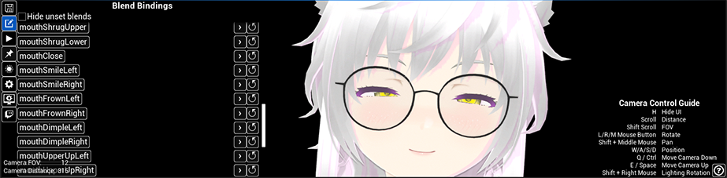
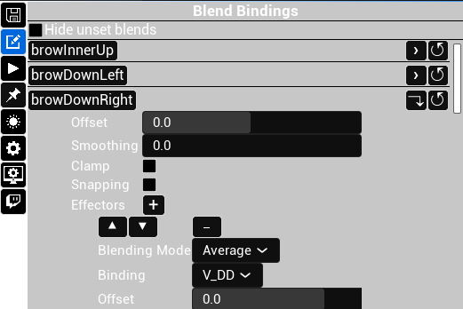
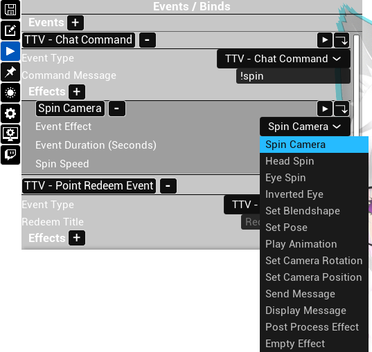
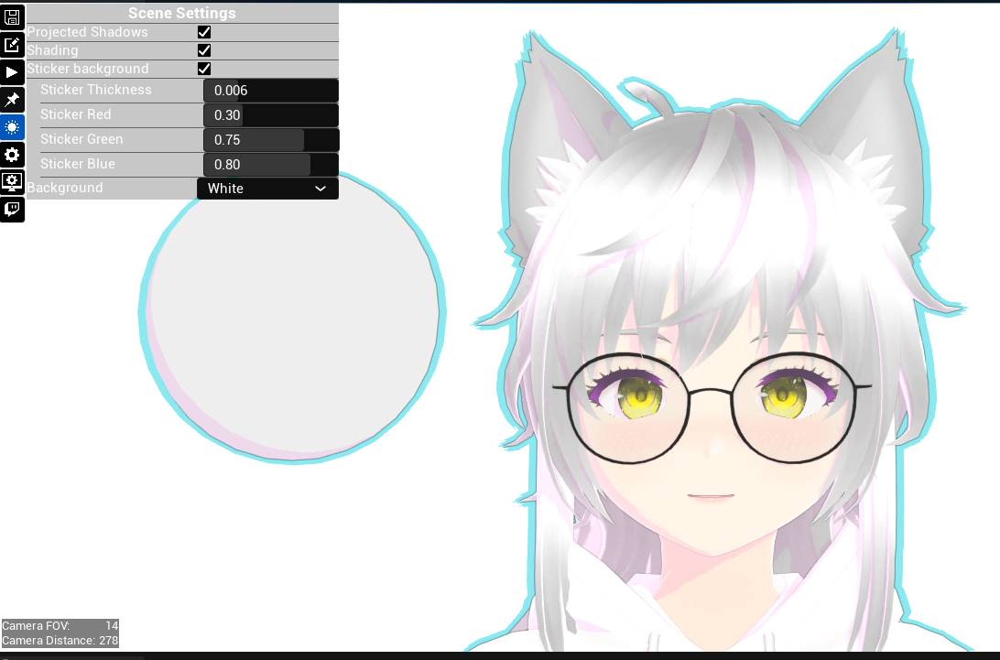

### UEVtube
UEVtube is a UE5 based virtual production tool made to assist in puppeting a virtual avatar for use with livestreaming services.
### Notable Features:
* VRM File format avatar loading.
* Live binding of morph targets to facial tracking blendshapes.
  * Multiple tracking blendshapes can be strung together using different blending modes to achieve very granular control of facial animation.
  * Morph targets may also be bound to audio visemes to improve mouth animation. This is performed using Oculus OVR Lipsync.

* Save and load avatar configurations as a external file to easily share setups between artists and users.
* Custom event system for Twitch.tv integration, and keybinds.
  * Bind events to chat commands, twitch rewards, paid subscriptions, and "bit" donations.
  * Events can execute a variety of functions such as setting morph targets, applying post processing effects, or even sending messages back on twitch.tv

* Custom post process based toon shading, outlines, and fresnel rim lighting for clean NPR stylization. These make use of unreal's normal lighting system.

* Iphone & Android facial tracking support 
  * Custom android app: "UEVtube Tracker" facial tracking that makes use of Mocap4Face by Alter.
  * Iphone facial tracking through Epic Games's LiveLink Face app.

The images in this portfolio make use of avatar created by twitch.tv/scootstir, UEVtube sees regular testing through her twitch streams.