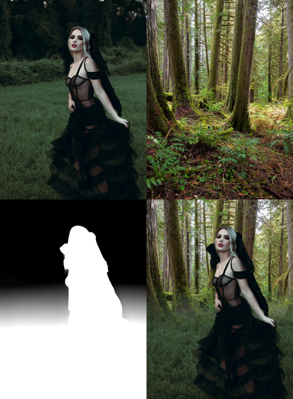
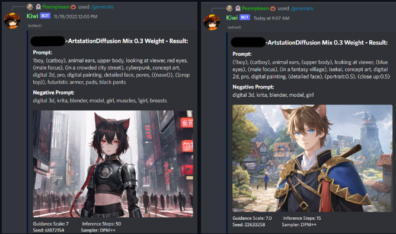
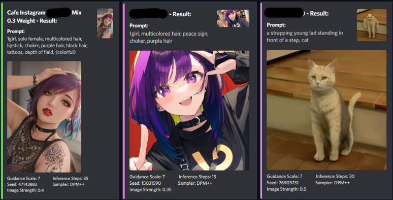
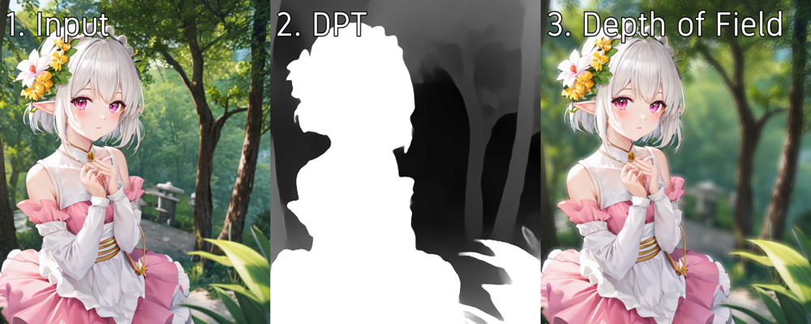

### Kiwi
[Github Link](https://github.com/PuddlePumpkin/KiwiSD)

Hikari Lightbulb Based Discord Bot functioning as a suite combining several different types of AI models, originally an experiment into generating basecolor textures for use with substance designer.

### Notable Features:
* Diffusion models: generate images and textures from a text prompt or image input
  * gif generation from diffusion results
  * per user settings for default post process and default prompts

* Dense Prediction Transformer image to depth model for generating image masks and depth of field / other filters automatically
  * image to depth
  * depth of field
  
  * depth to alpha
  * depth composite

* Basic image post processing

* ESRGan image upscaling

* Texture tile previewer - takes an input image and tiles it X times