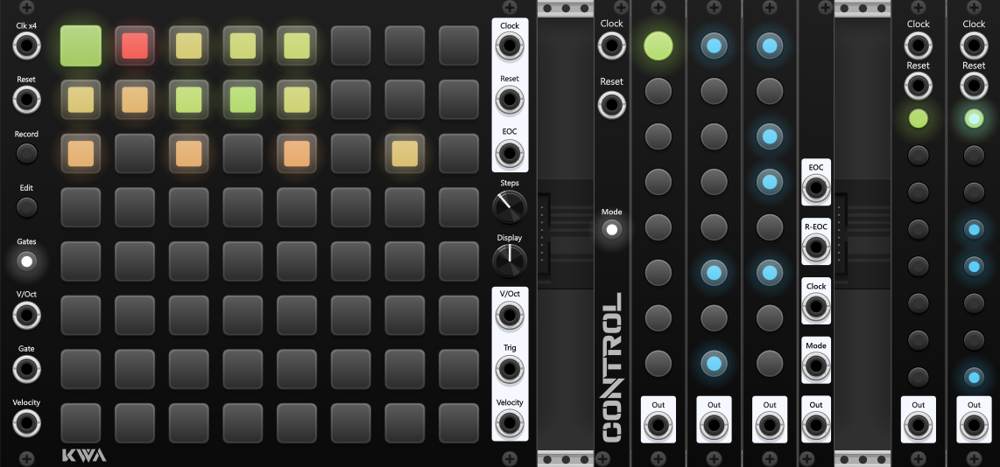

### KWA Modules
[Github Link](https://github.com/PuddlePumpkin/KWA-Modules-Public)

A collection of sequencer modules for modular synthesizer simulator software VCV Rack 2
### Notable Features:
* Live performance melodic sequencing with KWA Pitch 64. quantizes to a 4x clock signal for accurate recording of data.
  * expander module for controlling active page + sequencing order,

* Modular and standalone daisy chain trigger / drum sequencers, can connect an arbitrary amount played either as a continuous sequence or simultaneous sequencers for triggering drums or other events